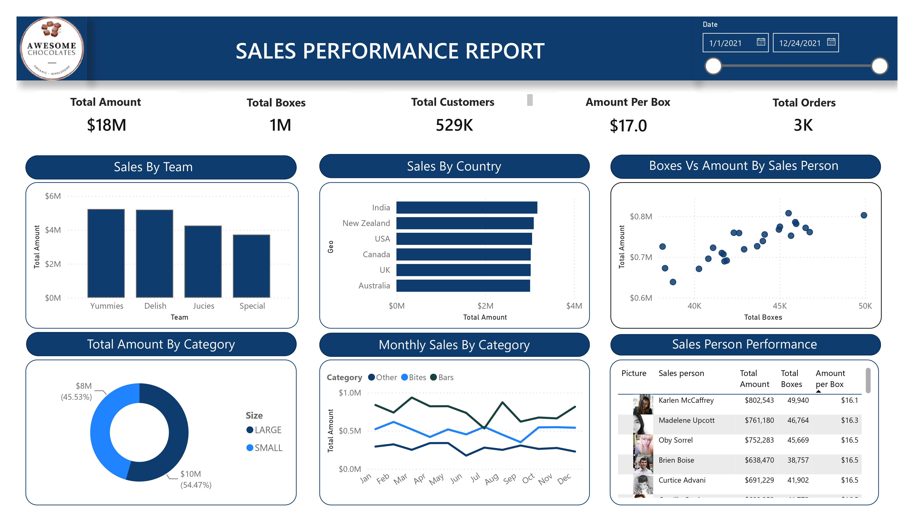

# Chocolate Sales & Revenue Performance Dashboard

An interactive Power BI dashboard analyzing sales performance, revenue trends, top-performing sales reps, and regional shipment distributions.

## Key Metrics & Business Insights
- **Revenue & Volume KPIs:** Tracks Total Amount ($18M), Total Boxes (1M), Total Customers (529K), and Total Orders (3K).
- **Team & Regional Analysis:** Evaluates revenue across teams (Yummies, Delish, Jucies, Special) and geographic markets.
- **Sales Rep Performance:** Scatter plot and tabular breakdown of sales representatives by total boxes sold vs. revenue generated.
- **Category Trends:** Monthly time-series sales patterns broken down by product categories and box sizes.

## Tools & Technologies
- **Power BI Desktop** (DAX Measures, Data Modeling, Custom UI Containers)
- **Power Query** (Data Transformation & ETL)
